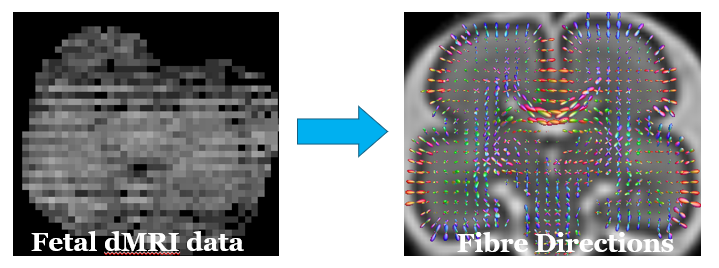

# SLICE TO VOLUME RECONSTRUCTION (SVR)

During MRI acquisition fetus moves. Fast acquisition of 2D slices freezes motion in time. Between-slice motion is the corrected with slice-to-volume registration and the 3D volume is reconstructed using super-resolution reconstruction.




[IRTK SIMPLE](https://github.com/mariadeprez/irtk-simple) is a  software package has been created to distribute software for motion correction and super-resolution reconstruction of **structural and diffusion MRI of the fetal brain**. The reconstruction algorithms were developed and implemented by [Dr Maria Deprez](https://www.kcl.ac.uk/people/maria-deprez) (Kuklisova Murgasova) within [IRTK](https://biomedia.doc.ic.ac.uk/software/irtk/) sofware package.

- [installation](https://github.com/mariadeprez/irtk-simple?tab=readme-ov-file#installation): Install and compile on UBUNTU
- [reconstruction of structural MRI](https://github.com/mariadeprez/irtk-simple?tab=readme-ov-file#structural-mri)
- [distortion correction for EPI](https://github.com/mariadeprez/irtk-simple?tab=readme-ov-file#distortion-correction)
- [spherical harmonics reconstruction of diffusion MRI](https://github.com/mariadeprez/irtk-simple?tab=readme-ov-file#diffusion-mri)
- [references](https://github.com/mariadeprez/irtk-simple?tab=readme-ov-file#references): Read detailed description of reconstruction algorithms
- [about irtk-simple](https://github.com/mariadeprez/irtk-simple?tab=readme-ov-file#about-irtk-simple): why the package was created
- [about irtk](https://github.com/mariadeprez/irtk-simple?tab=readme-ov-file#about-irtk)
- [disclaimer](https://github.com/mariadeprez/irtk-simple?tab=readme-ov-file#disclaimer)


References
----------

The [IRTK SIMPLE](https://github.com/mariadeprez/irtk-simple) package contains three main algorithms:

#### Motion correction and super-resolution reconstruction of fetal structural MRI
Reconstruction of fetal brain MRI with intensity matching and complete outlier removal. 
M Kuklisova-Murgasova, G Quaghebeur, MA Rutherford, JV Hajnal, JA Schanbel. 
Medical Image Analysis 16(8), 2012. doi: [10.1016/j.media.2012.07.004](https://doi.org/10.1016/j.media.2012.07.004)

#### Distortion correction of  fetal EPI
Distortion Correction in Fetal EPI Using Non-Rigid Registration With a Laplacian Constraint.
M Kuklisova-Murgasova, G Lockwood Estrin, RG Nunes, SJ Malik, MA Rutherford, D Rueckert, JV Hajnal
IEEE Transactions on Medical Imaging 37(1), 2018.
doi: [10.1109/TMI.2017.2667227](https://doi.org/10.1109/tmi.2017.2667227)

#### Spherical Harmonics reconstruction of fetal diffusion MRI
Higher Order Spherical Harmonics Reconstruction of Fetal Diffusion MRI With Intensity Correction.
M Deprez, A Price, D Christiaens, G Lockwood Estrin, L Cordero-Grande, J Hutter, A Daducci, JD Tournier, M Rutherford, SJ Counsell, M Bach Cuadra, JV Hajnal
IEEE Transactions on Medical Imaging 39(4), 2020.
doi: [10.1109/TMI.2019.2943565](https://doi.org/10.1109/tmi.2019.2943565)

About IRTK SIMPLE
-----
The [IRTK SIMPLE](https://github.com/mariadeprez/irtk-simple) package is based on a lightweight and easy to compile 
subset of Image Registration Toolkit (IRTK).

The package is parallelized using Threading Building Blocks (TBB), which is included
to ensure compatibility. 

Installation
------------

Installation instructions are available for UBUNTU systems. The dependences on the version of ubuntu have been minimised. It has not been tested on other systems.

* Install libraries:

	sudo apt-get install git cmake cmake-curses-gui g++ zlib1g-dev 

* Download package from the Gitlab repository

	git clone https://github.com/mariadeprez/irtk-simple.git
  	
	<br>(you will need to enter your username and the personal token)

* Build

	cd irtk-simple <br>
	mkdir build <br>
	cd build <br>
	cmake .. <br>
	make

* run the executables to display input arguments and options

	irtk-simple/build/bin/reconstruction <br>
	irtk-simple/build/bin/estimate-distortion <br>
	irtk-simple/build/bin/reconstructionDWI <br>

Structural MRI
---

The algorithm performs slice-to-volume registration and super-resolution reconstruction 
of **structural MRI of fetal brain**. It also includes intensity matching and robust statistics to 
reject misaligned and corrupted slices. Input data typically consists of several stacks of 2D slices 
of the fetal brain acquired in several different orientations. Typically, these are T2w HASTE, but
can be other structural sequences (e.g. T2w or T1w bSSFP). 

The example command:
```bash
reconstruction reconstructed_volume.nii.gz 3 axial_stack.nii.gz coronal_stack.nii.gz sagital_stack.nii.gz -mask axial_mask.nii.gz -packages 2 2 2 -thickness 2.5 2.5 2.5
```
It is essential to imput the brain (or head) mask. Packages refer to number of loops in acquisition order of the slices, 
e.g. if the slices are acquired as first odd then even, we have 2 packages. It is essential to input correct slice thickness 
for the super-resolution algorithm to work correctly.


Distortion correction
---

This command estimates **distortion of echo-planar imaging (EPI) of the fetal brain**, by registering the EPI stacks 
to the reconstructed stuctural volume, which is not affected by geometric distortion. 

The example command:
```bash
estimate-distortion corrected_EPI_stacks.nii.gz T2aligned.nii.gz EPI_stacks.nii.gz -thickness 3.5 -mask mask.nii.gz  -phase y  -packages 2 -save_fieldmap fieldmap.nii.gz  
```
EPI stacks are in one nifti file which can be 3D or 4D if there are multiple stacks. The assumption is that the geometric distortion is stationary for these stacks. 
It is important to ensure that phase-encoding direction (in which the distortion occurs) entered correctly (can be x or y, z is always slice direction), otherwise
the algorithm will not work correctly. The command will save corrected EPI stacks, and as an opion also estimated distortion field (fieldmap).

The distortion should be estimated from the B0 diffusion stacks (non-diffusion waited, e.g. b=0) or fMRI stacks. For diffusion weighted (DWI) stacks (b>0) 
the fieldmap estimated from the B0 stacks can be applied to correct them too. Example command:
```bash
fieldmapcorrect DWI_stacks.nii.gz corrected_DWI_stacks.nii.gz fieldmap.nii.gz -y
```
To ensure that fieldmap is correctly applied, input the coordinate on which the correction should be performed, 
e.g. `-x` or `-y`. If the direction in which the fieldmap needs to be applied descending, use option `-minus`.


Diffusion MRI
---
This command reconstruct **diffusion weighed MRI (DWI) of the fetal brain** on the regular grid using **Sherical Harmonics representation**. Note that input signal `DWI_signal.nii.gz` should correspond 
to a single b-value (e.g. b=1000). Gradient table `grad.b` needs to be in [MRtrix3](https://www.mrtrix.org/) format.

An example command:
```bash
reconstructionDWI DWI_recon.nii.gz DWI_signal.nii.gz grad.b T2-template.nii.gz orient.dof -mask $mask -packages 2 -resolution 2
```
The fetal brain in DWI signal is usually in random orientation, as it was positioned in the scanner space. The command asks for a T2 weighted structural brain MRI image in standard orientation `T2-template.nii.gz` and a rigid transformation `orient.dof` that approximatelly reorients the diffusion data to the T2 template space. To check that your files are correct, download IRTK viewer `rview` 
[here](https://www.doc.ic.ac.uk/~dr/software/download.html) and check the alignment.
```bash
rview T2-template.nii.gz DWI_signal.nii.gz orient.dof
```
You can also create the transformation `orient.dof` manually in `rview`. It might be helpful to make sure that the origins of both images are set to zero to facilitate this, this can be achieved by IRTK command `headertool` also provided in this package.

The reconstructed signal `DWI_recon.nii.gz` can be viewed in `rview`. However, visualisation of of the fibre orientation distribution needs to be performed in [MRtrix3](https://www.mrtrix.org/):
```bash
dwi2response tournier DWI_recon.nii.gz response.txt -lmax 6 -grad grad.b -mask mask.nii.gz
dwi2fod csd DWI_recon.nii.gz response.txt csd.mif -lmax 6 -grad grad.b -mask mask.nii.gz
mrview T2.nii.gz -odf.load_sh  csd.mif
```


About IRTK
---	

IRTK stands for Image Registration Toolkit

Authors: Daniel Rueckert and Julia Schnabel 

The registration algorithms implemented in the software are described by 
the following publications:

J. A. Schnabel, D. Rueckert, M. Quist, J. M. Blackall, A. D. Castellano Smith, 
T. Hartkens, G. P. Penney, W. A. Hall, H. Liu, C. L. Truwit, F. A. Gerritsen, 
D. L. G. Hill, and D. J. Hawkes. A generic framework for non-rigid registration 
based on non-uniform multi-level free-form deformations. In Fourth Int. Conf. on 
Medical Image Computing and Computer-Assisted Intervention (MICCAI '01), pages 
573-581, Utrecht, NL, October 2001

D. Rueckert, L. I. Sonoda, C. Hayes, D. L. G. Hill, M. O. Leach, and D. J. Hawkes. 
Non-rigid registration using free-form deformations: Application to breast MR 
images. IEEE Transactions on Medical Imaging, 18(8):712-721, 1999.

E. R. E. Denton, L. I. Sonoda, D. Rueckert, S. C. Rankin, C. Hayes, M. Leach, D. 
L. G. Hill, and D. J. Hawkes. Comparison and evaluation of rigid and non-rigid 
registration of breast MR images. Journal of Computer Assisted Tomography, 
23:800-805, 1999.

Disclaimer
---

This software has been developed for research purposes only, and hence should not be 
used as a diagnostic tool. In no event shall the authors or distributors be liable to 
any direct, indirect, special, incidental, or consequential damages arising of the use 
of this software, its documentation, or any derivatives thereof, even if the authors 
have been advised of the possibility of such damage.


